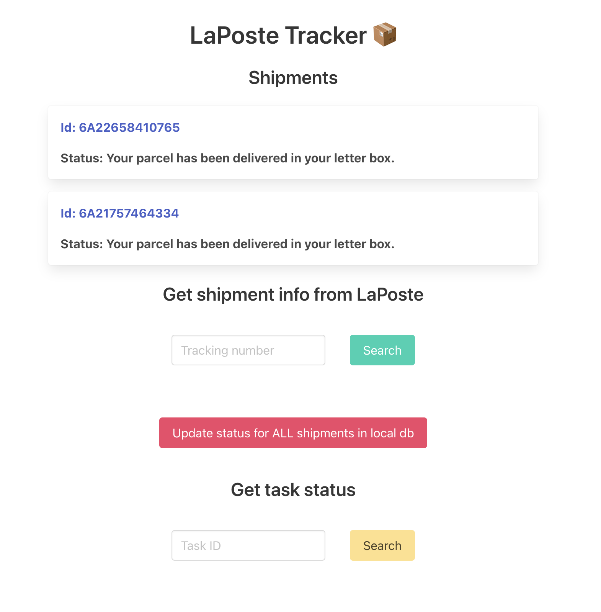

# Luko LaPoste service

#### Setup

- Install python 3.7 & poetry
- `poetry install` to install project's requirements

### Environment
Copy `.env.template` to `.env` and fill `LAPOSTE_KEY` with your La Poste API key

#### Run

- `poetry shell` to enter virtual environment (loading the variables in .env)
- `flask run`
- run Celery worker `celery -A app.main.celery worker --loglevel=info`

### Docker

To avoid building services locally just run `docker-compose up` and here we go

